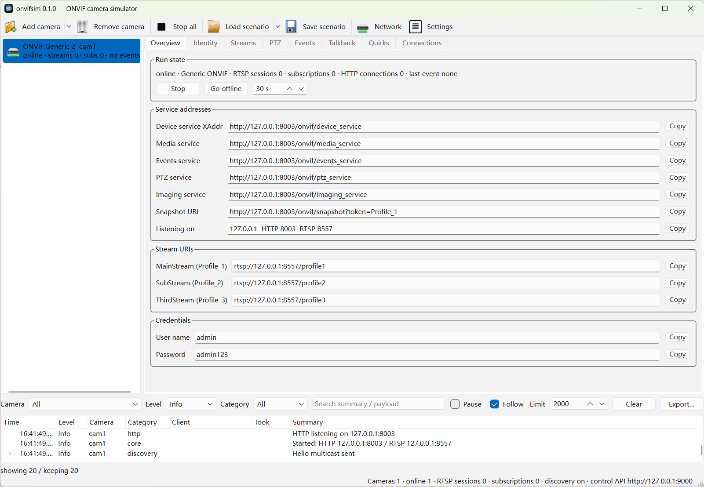

# onvifsim

[](https://github.com/mrtian2016/onvifsim/actions/workflows/ci.yml)
[](https://github.com/mrtian2016/onvifsim/releases)
[](LICENSE)


A self-contained ONVIF camera simulator for testing NVRs, VMS software, home-automation integrations and mobile clients.

- One executable, no runtime dependencies (no ffmpeg, no Python). Windows / macOS / Linux.
- Simulates any number of cameras: WS-Discovery, authentication, RTSP streaming with embedded H.264 clips, snapshots, PTZ, imaging, PullPoint events, two-way audio (backchannel).
- Every camera can be a "well-behaved" device or reproduce real-world firmware quirks with a checkbox — **90 fault-injection switches, every one of them traced to observed device behavior**.
- GUI (Qt Widgets) plus a headless mode with a REST control API and scenario files for CI.

[中文](README.zh-CN.md) ｜ full design in [docs/plan.md](docs/plan.md) (Chinese)

<br clear="left">



## Why

Testing an ONVIF client against real cameras is slow and, worse, misleading: the one
camera on your desk behaves itself. The bugs that reach your users come from the
cameras you do not own — the one whose ProbeMatch omits MetadataVersion, the one that
advertises a port it does not listen on, the one that hands out a subscription manager on
a different port and then forgets about it.

onvifsim gives you those cameras on demand. Turn on a switch, and the simulator starts
misbehaving in exactly the way a specific real device does, so you can write a regression
test for it. Turn it off and it is a well-behaved camera again.

It is a **test tool**. It is not a virtual camera for streaming your own video, not an
ONVIF client, and not a production service — see [Security](#security).

## Quick start

```bash
onvifsim                                    # GUI, creates one camera automatically
onvifsim --headless --cameras 8 --preset hikvision
onvifsim --headless --scenario assets/scenarios/tplink-full-house.json
onvifsim --list-quirks                      # every fault-injection switch
```

Once running: ONVIF at `http://<ip>:8000/onvif/device_service`, RTSP at `rtsp://<ip>:8554/...`,
control API at `http://127.0.0.1:9000/api/cameras`. Default credentials `admin` / `admin123`.

Paths above are relative to a source checkout. Installed packages put the scenarios in
`/usr/share/onvifsim/scenarios/` (deb), next to the executable (Windows zip), or inside
the app bundle (macOS); `--list-scenarios` prints the built-in ones, which work by name
regardless of where you installed.

## Vendor personas

`generic`, `hikvision`, `dahua`, `reolink`, `vigi` (TP-Link VIGI), `tplink` (TL-IPC),
`axis`, `uniview`.

A persona decides the device-information triple, RTSP and snapshot path style, profile
naming, event topic naming, backchannel track layout, the vendor's private HTTP API
(Hikvision ISAPI, Dahua CGI, Reolink JSON-RPC, VIGI self-signed HTTPS, TL-IPC `/stok=`),
and which quirks are on by default.

## Fault injection

This is the point of the project: not just to be a correct ONVIF camera, but to
**reproduce real firmware misbehavior on demand**. 90 switches in seven groups
(discovery, connect/auth, media and snapshots, PTZ, events, RTSP and talkback,
transport), each carrying a source ID that points at the observation behind it.
Full table in [docs/quirks.md](docs/quirks.md).

A few examples:

| Switch | Real behavior it reproduces |
|---|---|
| `discovery.no_metadata_version` | ProbeMatch without MetadataVersion — clients drop the whole packet and the device vanishes |
| `connect.xaddr_odd_port` | XAddr advertises `:2020` while the device actually listens on 80 |
| `connect.media2_first` | Media2 listed before Media in GetServices, routing ver10 calls to the ver20 endpoint |
| `events.bad_xml` | GetEventProperties returning XML with unquoted attribute values |
| `events.subscription_port_increment` | Subscription manager on its own, incrementing port |
| `rtsp.talkback_busy_slot` | New backchannel DESCRIBE gets 401 for a few seconds after TEARDOWN |
| `ptz.factory_300_presets` | 300 factory preset slots all sharing one fake position |
| `media.snapshot_empty_body` | `200 OK` + `image/jpeg` + empty body |

Switches can be set globally, per camera, or flipped at runtime over REST:

```bash
curl -X PATCH -H 'Content-Type: application/json' \
  -d '{"quirks":{"rtsp.rtp_packet_loss":{"enabled":true,"params":{"percent":15}}}}' \
  http://127.0.0.1:9000/api/cameras/cam1
```

## Scenarios

`assets/scenarios/` ships eight ready-made setups: single camera, eight mixed brands,
bad network, talkback trio, event storm, legacy firmware, the TP-Link full house, and a
discovery-quirks set. A scenario only needs to spell out the differences; everything else
is inherited from the persona. See [docs/scenarios.md](docs/scenarios.md).

## Linux downloads

- `onvifsim-<version>-x86_64.AppImage` — bundles Qt, `chmod +x` and run, works on any distro
- `onvifsim_<version>-1_amd64.deb` — Debian/Ubuntu, `sudo apt install ./onvifsim_*.deb`, uses the system Qt 6.2+
- `onvifsim-<version>-linux-x86_64.tar.gz` — portable directory, uses the system Qt

## macOS downloads

- `onvifsim-<version>-macos-arm64.dmg` — drag onvifsim.app into Applications

The bundle is **ad-hoc signed**, not notarized, so Gatekeeper blocks the first launch.
Right-click the app and choose *Open*, or:

```bash
xattr -dr com.apple.quarantine /Applications/onvifsim.app
```

## Windows downloads

- `onvifsim-<version>-windows-x64-setup.exe` — guided installer
- `onvifsim-<version>-windows-x64.zip` — portable, unzip and run

Both ship two executables: double-click `onvifsim.exe` for the GUI, use
`onvifsim-cli.exe` from a command prompt (a GUI-subsystem binary on Windows has no
console attached, so `--headless` and friends would print nothing).

## Docker

A headless image is published to `ghcr.io/mrtian2016/onvifsim` on every release:

```bash
docker run --rm -p 8000:8000 -p 8554:8554 -p 9000:9000 \
  ghcr.io/mrtian2016/onvifsim --headless --cameras 4 --control-bind 0.0.0.0
```

Port mapping is enough for a client that is told the IP by hand. It is **not** enough for
WS-Discovery: multicast does not cross a bridge network, so the cameras will not be found
automatically. For that, put the container on a macvlan network — see
[packaging/docker/README.md](packaging/docker/README.md).

## Building

Requires CMake ≥ 3.21, Qt ≥ 6.2, a C++17 compiler. **No third-party libraries.**

```bash
conda create -n onvifsim qt6-main cmake ninja cxx-compiler   # reference toolchain, all three platforms
conda activate onvifsim
cmake --preset conda-linux && cmake --build --preset conda-linux
ctest --preset conda-linux
```

Distro Qt works too (6.2 on Ubuntu 22.04 / Debian 12) — see [docs/building.md](docs/building.md).

## Security

onvifsim is a test tool meant for a lab network or your own machine. Two things are worth
knowing before you put it anywhere else:

- **The control API has no authentication unless you give it a token.** It can create and
  delete cameras, load scenarios and add IP aliases. It binds to `127.0.0.1` by default;
  if you move it (`--control-bind 0.0.0.0`, containers), pass `--control-token <token>`
  as well. Cross-origin headers are only sent when a token is set, so a random web page
  cannot drive it.
- **The device credentials are `admin` / `admin123` by default**, and the bundled TLS
  certificate for the TP-Link VIGI persona is a self-signed throwaway whose private key
  ships in this repository on purpose. Neither is a secret.

To report a vulnerability, see [SECURITY.md](SECURITY.md).

## Documentation

- [docs/quirks.md](docs/quirks.md) — the full fault-injection table (generated from code)
- [docs/control-api.md](docs/control-api.md) — REST control API
- [docs/scenarios.md](docs/scenarios.md) — scenario file format
- [docs/building.md](docs/building.md) — building on all three platforms
- [docs/architecture.md](docs/architecture.md) — architecture and data flow
- [docs/compat-matrix.md](docs/compat-matrix.md) — interoperability matrix against real clients
- [docs/plan.md](docs/plan.md) — the full design document (Chinese)

## Contributing

Bug reports about *real* camera behavior are the most valuable thing you can send: if you
have a device that misbehaves in a way onvifsim cannot reproduce yet, that is a feature
request with evidence. See [CONTRIBUTING.md](CONTRIBUTING.md).

## License

MIT, see [LICENSE](LICENSE).
