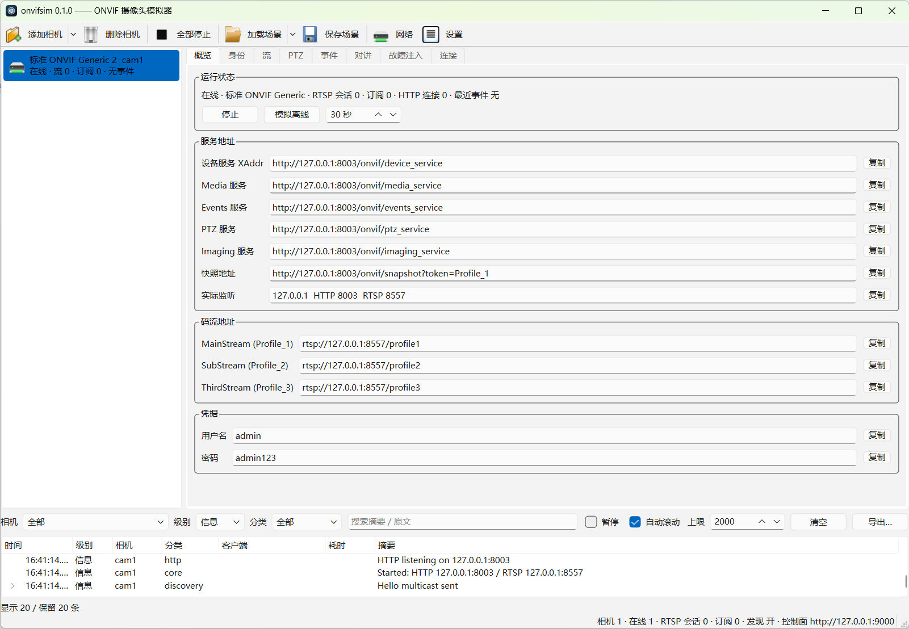

# onvifsim

[](https://github.com/mrtian2016/onvifsim/actions/workflows/ci.yml)
[](https://github.com/mrtian2016/onvifsim/releases)
[](LICENSE)


独立的 ONVIF 摄像头模拟器，用来测试 NVR、监控软件、家庭自动化集成和移动端 App。

- 一个可执行文件，运行期零依赖（不要 ffmpeg、不要 Python），Windows / macOS / Linux 双击即用。
- 模拟任意多台相机：WS-Discovery 发现、鉴权、内嵌 H.264 样片的 RTSP 取流、快照、PTZ、图像、PullPoint 事件、对讲。
- 每台相机既能当「标准相机」，也能勾一个框变成「有真机毛病的相机」——**90 条故障注入开关，每条都来自真实固件实证**。
- Qt Widgets 界面，另有无界面模式 + REST 控制面 + 场景文件，可进 CI。

[English](README.md) ｜ 完整设计见 [docs/plan.md](docs/plan.md)

<br clear="left">



## 为什么要有这个

拿真相机测 ONVIF 客户端，慢，而且会给人错觉：**手边那台是好好的**。真正把用户坑到的
是那些你手上没有的相机 —— ProbeMatch 里不带 MetadataVersion 的那台、对外宣称一个
自己根本没监听的端口的那台、把订阅管理器扔到另一个端口上然后自己忘了的那台。

onvifsim 让你随时把这些相机变出来。勾一个开关，模拟器就开始按某台真机的方式犯病，
你可以照着写一条回归用例；关掉它，又变回一台规规矩矩的相机。

它是**测试工具**：不是用来推自有视频流的虚拟摄像头，不是 ONVIF 客户端，
也不是能对外提供服务的生产组件 —— 见 [安全](#安全)。

## 快速开始

```bash
onvifsim                                    # 起界面，自动建一台相机
onvifsim --headless --cameras 8 --preset hikvision
onvifsim --headless --scenario assets/scenarios/tplink-full-house.json
onvifsim --list-quirks                      # 看全部故障注入开关
```

起来之后：ONVIF 地址在 `http://<ip>:8000/onvif/device_service`，RTSP 在 `rtsp://<ip>:8554/...`，
控制面在 `http://127.0.0.1:9000/api/cameras`。默认账号 `admin` / `admin123`。

上面的路径是源码树里的。装成包之后场景文件在 `/usr/share/onvifsim/scenarios/`（deb）、
可执行文件旁边（Windows zip）或 app 包内部（macOS）；内置场景用 `--list-scenarios`
列出来之后**按名字**引用，装在哪儿都一样。

## 品牌预设

`generic`（标准 ONVIF）、`hikvision`、`dahua`、`reolink`、`vigi`（TP-Link VIGI）、
`tplink`（TL-IPC）、`axis`、`uniview`。

每个预设决定设备信息三件套、RTSP / 快照路径风格、profile 命名、事件 topic 命名、
对讲轨道布局、厂商私有 HTTP API（海康 ISAPI / 大华 CGI / Reolink JSON-RPC /
VIGI 自签 HTTPS / TL-IPC `/stok=` ），以及默认打开哪些故障注入。

## 故障注入

这是本项目的核心：不只是做一台正确的相机，而是**按需复现真实固件的毛病**。
90 条开关分七组（发现 / 建连鉴权 / Media 与快照 / PTZ / 事件 / RTSP 与对讲 / 传输），
每条都带一个出处编号，指向实测记录。全表见 [docs/quirks.md](docs/quirks.md)。

几个例子：

| 开关 | 复现的真机行为 |
|---|---|
| `discovery.no_metadata_version` | ProbeMatch 缺 MetadataVersion，客户端整包丢弃，设备凭空消失 |
| `connect.xaddr_odd_port` | XAddr 报 `:2020` 而实际连 80，测客户端「只接管 host:port、保留 path」的逻辑 |
| `connect.media2_first` | GetServices 里 Media2 排在 Media 前，把 ver10 请求引到 ver20 端点上 |
| `events.bad_xml` | GetEventProperties 返回属性值不加引号的非法 XML |
| `events.subscription_port_increment` | 订阅管理器开在独立端口且每次递增 |
| `rtsp.talkback_busy_slot` | TEARDOWN 后几秒内新的对讲 DESCRIBE 一律 401 |
| `ptz.factory_300_presets` | 出厂预填 300 个预置位槽，全部共享同一个假坐标 |
| `media.snapshot_empty_body` | `200 OK` + `image/jpeg` + 空响应体 |

开关可以全局设、按相机设，也可以运行时用 REST 改：

```bash
curl -X PATCH -H 'Content-Type: application/json' \
  -d '{"quirks":{"rtsp.rtp_packet_loss":{"enabled":true,"params":{"percent":15}}}}' \
  http://127.0.0.1:9000/api/cameras/cam1
```

## 场景文件

`assets/scenarios/` 下有 8 个开箱即用的场景：单相机、8 路混品牌、恶劣网络、
对讲三连、事件风暴、老固件、TP-Link 全家桶、发现层怪癖集。场景只需写差异部分，
其余从品牌预设继承。详见 [docs/scenarios.md](docs/scenarios.md)。

## Linux 产物

- `onvifsim-<版本>-x86_64.AppImage` —— 自带 Qt，`chmod +x` 就能跑，不挑发行版
- `onvifsim_<版本>-1_amd64.deb` —— Debian / Ubuntu 用 `sudo apt install ./onvifsim_*.deb` 装，靠系统 Qt 6.2+
- `onvifsim-<版本>-linux-x86_64.tar.gz` —— 便携目录，靠系统 Qt

## macOS 产物

- `onvifsim-<版本>-macos-arm64.dmg` —— 把 onvifsim.app 拖进「应用程序」

签名是 **ad-hoc** 的，没有经过 Apple 公证，所以第一次打开会被 Gatekeeper 拦下来。
右键 →「打开」，或者：

```bash
xattr -dr com.apple.quarantine /Applications/onvifsim.app
```

## Windows 产物

- `onvifsim-<版本>-windows-x64-setup.exe` —— 引导式安装包，双击下一步
- `onvifsim-<版本>-windows-x64.zip` —— 免安装版，解压即跑

包里有两个可执行文件：双击 `onvifsim.exe` 走图形界面；命令行用 `onvifsim-cli.exe`
（Windows 上图形子系统的程序在 cmd 里拿不到控制台，`--headless` 那些看不到输出）。

## Docker

每次发版都会往 `ghcr.io/mrtian2016/onvifsim` 推一个无界面镜像：

```bash
docker run --rm -p 8000:8000 -p 8554:8554 -p 9000:9000 \
  ghcr.io/mrtian2016/onvifsim --headless --cameras 4 --control-bind 0.0.0.0
```

端口映射只够让「手工填 IP」的客户端连上，**不够用来做 WS-Discovery**：
多播过不了 bridge 网络，客户端搜不到设备。要发现能用就得把容器挂到 macvlan 上，
见 [packaging/docker/README.md](packaging/docker/README.md)。

## 构建

需要 CMake ≥ 3.21、Qt ≥ 6.2、C++17 编译器。**不依赖任何第三方库。**

```bash
conda create -n onvifsim qt6-main cmake ninja cxx-compiler   # 三平台统一的参考工具链
conda activate onvifsim
cmake --preset conda-linux && cmake --build --preset conda-linux
ctest --preset conda-linux
```

发行版自带的 Qt（Ubuntu 22.04 / Debian 12 的 6.2）也能编。详见 [docs/building.md](docs/building.md)。

## 安全

onvifsim 是给实验室网络和自己机器用的测试工具。放到别处之前有两件事要知道：

- **不给 token 的话，控制面是没有鉴权的。** 它能建相机、删相机、加载场景、加 IP 别名。
  默认只绑 `127.0.0.1`；一旦挪了位置（`--control-bind 0.0.0.0`、容器里），
  请同时带上 `--control-token <令牌>`。跨域头只在设了 token 时才发，
  所以随便一个网页驱动不了它。
- **设备默认账号是 `admin` / `admin123`**，TP-Link VIGI 预设用的那张自签证书，
  私钥是**故意**放进仓库的一次性测试钥匙。两者都不是秘密。

报告安全问题见 [SECURITY.md](SECURITY.md)。

## 文档

- [docs/quirks.md](docs/quirks.md) —— 故障注入全表（从代码生成）
- [docs/control-api.md](docs/control-api.md) —— REST 控制面
- [docs/scenarios.md](docs/scenarios.md) —— 场景文件格式
- [docs/building.md](docs/building.md) —— 三平台构建
- [docs/architecture.md](docs/architecture.md) —— 架构与数据流
- [docs/compat-matrix.md](docs/compat-matrix.md) —— 与真实客户端的互操作手测矩阵
- [docs/plan.md](docs/plan.md) —— 完整设计稿

## 参与

**关于真机行为的 issue 是最有价值的**：手上有一台以某种方式犯病、而 onvifsim
还复现不了的相机，那就是一条带证据的功能请求。见 [CONTRIBUTING.md](CONTRIBUTING.md)。

## 许可证

MIT，见 [LICENSE](LICENSE)。
